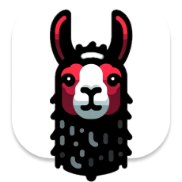

<p align="center">
  
</p>

# node-red-contrib-ollama

A Node-RED module that wraps the [ollama.js](https://github.com/ollama/ollama-js) library, offering its functionalities as configurable nodes for easy integration into flows.

## Requirements

To use it, you need to have Node-RED installed on your system. For more information on how to install Node-RED, refer to the official [Node-RED documentation](https://nodered.org/docs/getting-started/).

Also you need to install the Ollama on the same system. For more information on how to install Ollama, refer to the official [Ollama site](https://ollama.com/).

## Installation

To install the module, you can use the Node-RED editor or the Node-RED command-line tool.

### Node-RED Editor

1. Open the Node-RED editor.
2. Click on the menu button in the top-right corner.
3. Select "Manage palette".
4. Go to the "Install" tab.
5. Search for "node-red-contrib-ollama".
6. Click on the "Install" button.

### Node-RED Command-Line Tool

1. Open a terminal.
2. Run the following command:

```bash
npm install node-red-contrib-ollama
```

After installing the module, you need to restart Node-RED to apply the changes.

## Usage

The module provides a set of nodes that can be used to interact with the ollama.js library. The nodes are:

- **Chat**: Generate the next message in a chat with a provided model.
- **Copy**: Copy a model. Creates a model with another name from an existing model.
- **Create**: Create a model from a [Modelfile](https://github.com/ollama/ollama/blob/main/docs/modelfile.md).
- **Delete**: Delete a model and its data.
- **Embeddings**: Generate embeddings from a model.
- **Generate**: Generate a response for a given prompt with a provided model.
- **List**: List models that are available locally.
- **Pull**: Download a model from the [ollama library](https://ollama.com/library).
- **Push**: Upload a model to a model library. Requires registering for ollama.ai and adding a public key first.
- **Show**: Show information about a model including details, modelfile, template, parameters, license, and system prompt.

Each node has its own set of configuration options that can be used to customize its behavior. For more information on how to use each node, refer to the help text provided in the Node-RED editor.

## License

This project is licensed under the MIT License - see the [LICENSE](LICENSE) file for details.